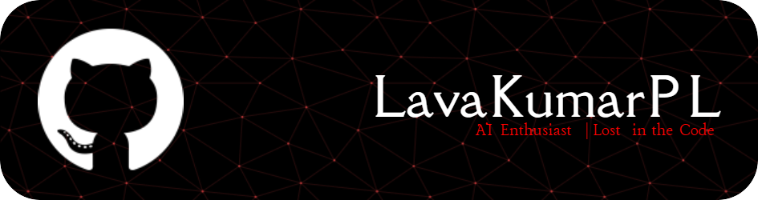

# Welcome to My GitHub Profile

### Hey there! 👋 I'm Lava Kumar P L

  

---

### Welcome to My GitHub!  
👋 Hi, I’m Lava Kumar, a passionate Computer Science student and aspiring AI Engineer currently diving deep into AI, Web Development and Software Development.

💡 I believe in the transformative power of technology and I’m constantly exploring innovative ways to apply tech in real-world applications.

🚀 Let’s connect! Feel free to check out my repositories and get in touch if you're interested in collaboration or discussing cutting-edge tech.

🔗 Excited to connect with fellow developers, engineers, and AI enthusiasts!

---

### 🌟 Featured Projects
- [Project Name - Description](https://github.com/your-username/project-repo): A brief description of your project.
  - **Technologies**: Python, TensorFlow, etc.
  -  
- [Project Name - Description](https://github.com/your-username/project-repo): Another project description.
  - **Technologies**: JavaScript, React, etc.
  -  

---

### 🛠️ Technical Skills
          

---

### 📫 Connect with Me!
  
  

---

### ⚡In a Nutshell:
I love solving problems with code and am always up for learning something new!

---

 

